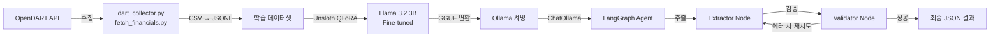

# 🚀 Stock Assistant AI: LangGraph & SLM 기반 주식 투자 도우미

본 프로젝트는 기업의 **재무제표 데이터(OpenDART)**를 수집하고, **SLM(Llama 3.2 3B)** 파인튜닝과 **LangGraph**를 활용하여 고도화된 투자 분석 에이전트를 구축하는 것을 목표로 합니다.

---

## 🛠️ Tech Stack

| 구분 | 기술 |
|------|------|
| **Language** | Python 3.11 (Conda Environment) |
| **Orchestration** | LangGraph, LangChain |
| **Domain SLM** | Llama 3.2 3B → Unsloth QLoRA 파인튜닝 → GGUF 변환 |
| **Inference Server** | Ollama (로컬 서빙) |
| **Data Source** | OpenDART API (재무제표) |
| **Database** | SQLite / Supabase (예정) |
| **GPU** | NVIDIA GTX 1660 Super (VRAM 6GB) |

---

## 📁 Project Structure

```text
stock-agent/
├── backend/
│   ├── data/
│   │   └── raw/                  # 원본 CSV (상장사 리스트, 재무제표 등)
│   ├── src/
│   │   ├── slm/                  # SLM 파인튜닝 관련
│   │   │   ├── finetune.py       # Unsloth + QLoRA 파인튜닝 스크립트
│   │   │   ├── inference.py      # 파인튜닝 모델 추론 테스트
│   │   │   └── dart_financial_analysis_dataset.jsonl  # 학습 데이터셋
│   │   └── tools/                # 데이터 수집 도구
│   │       ├── dart_collector.py     # 상장사 리스트 수집
│   │       └── fetch_financials.py   # 대량 재무제표 수집 (이어받기 지원)
│   ├── .env                      # API Keys (GIT IGNORE 필수)
│   └── requirements.txt
├── models/
│   ├── dart_model_v1.gguf        # 파인튜닝된 GGUF 모델 파일
│   ├── Modelfile                 # Ollama 모델 등록 설정
│   ├── dart_langgraph.py         # LangGraph 에이전트 (추출→검증→재시도)
│   └── dart_test.py              # Ollama 연동 테스트 스크립트
└── .gitignore
```

---

## ⚙️ Setup Instructions

### 1. 가상환경 설정 (Conda)

```bash
conda create -n stock-agent python=3.11 -y
conda activate stock-agent
pip install -r backend/requirements.txt
```

### 2. 환경 변수 설정

`backend/.env` 파일을 생성하고 아래 키를 입력:

```text
DART_API_KEY=your_api_key_here
OPENAI_API_KEY=your_openai_key_here
```

### 3. 데이터 수집 실행

```bash
# Step 1: 상장사 리스트 수집
cd backend/src/tools
python dart_collector.py

# Step 2: 재무제표 대량 수집 (이어받기 모드 지원)
python fetch_financials.py
```

### 4. SLM 파인튜닝 (WSL 환경 권장)

```bash
# Unsloth 설치
pip install "unsloth[colab-new] @ git+https://github.com/unslothai/unsloth.git"
pip install --no-deps "xformers<0.0.27" "trl<0.9.0" peft accelerate bitsandbytes

# 파인튜닝 실행
cd backend/src/slm
python finetune.py
```

### 5. Ollama 모델 등록 & 실행

```bash
# GGUF 모델을 Ollama에 등록
cd models
ollama create dart_model_v1 -f Modelfile

# 테스트
python dart_test.py
```

### 6. LangGraph 에이전트 실행

```bash
cd models
python dart_langgraph.py
```

---

## �️ Architecture



---

## 🎯 Milestone Progress

### ✅ Step 1 — Data Collection (완료)
- [x] 프로젝트 폴더 구조 설계
- [x] 상장사 고유번호(corp_code) 리스트 수집 (`dart_collector.py`)
- [x] 시가총액 상위 종목 대상 재무제표 대량 수집 (`fetch_financials.py`)
- [x] 이어받기(Resume) 로직으로 안정적 대량 수집 지원

### ✅ Step 2 — SLM Fine-tuning (완료)
- [x] DART 재무 데이터 기반 학습 데이터셋(JSONL) 구축
- [x] Unsloth + QLoRA로 Llama 3.2 3B 모델 파인튜닝 (`finetune.py`)
- [x] 파인튜닝 결과 추론 테스트 (`inference.py`)
- [x] GGUF 포맷 변환 및 내보내기 (`dart_model_v1.gguf`)

### ✅ Step 3 — Ollama Deployment & LangGraph Agent (완료)
- [x] Ollama Modelfile 작성 및 로컬 서빙 설정
- [x] ChatOllama 연동 테스트 (`dart_test.py`)
- [x] LangGraph 에이전트 구현 (`dart_langgraph.py`)
  - 추출(Extractor) → 검증(Validator) → 조건부 재시도 파이프라인
  - 최대 3회 자동 재시도 로직

### 🔲 Step 4 — 고도화 (예정)
- [ ] 프론트엔드 대시보드 (React)
- [ ] DB 연동 (SQLite / Supabase)
- [ ] 실시간 주가 연동 및 분석 리포트 생성
- [ ] 멀티 에이전트 구조 확장

---

## ⚠️ PC 작업 시 참고 (GPU 사양)

- **GPU:** NVIDIA GTX 1660 Super (VRAM 6GB)
- **Strategy:** 8B 모델보다는 **Llama 3.2 3B**급 모델을 선택하여 **Unsloth + QLoRA**로 로컬 파인튜닝.
- **Optimization:** VRAM 부족 시 Google Colab 또는 RunPod을 활용한 클라우드 학습 병행.
