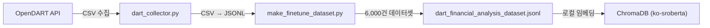
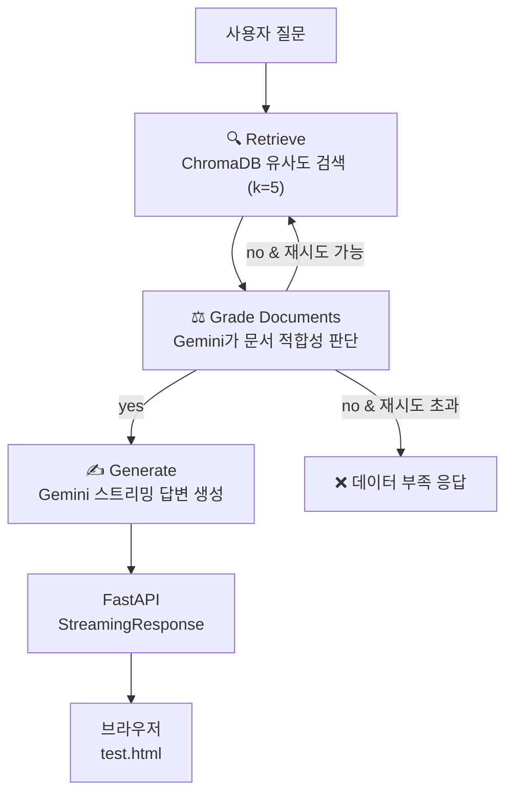

# 🚀 Stock Assistant AI: LangGraph + RAG 기반 재무 분석 챗봇

OpenDART에서 수집한 **상장사 재무제표 데이터**를 벡터 DB(ChromaDB)에 임베딩하고, **LangGraph** 기반 멀티스텝 파이프라인(검색 → 품질 평가 → 답변 생성)과 **Gemini 2.5 Flash** 스트리밍 응답을 제공하는 재무 분석 챗봇입니다.

---

## 🛠️ Tech Stack

| 구분               | 기술                                                  |
| ------------------ | ----------------------------------------------------- |
| **Language**       | Python 3.11 (Conda)                                   |
| **LLM**            | Gemini 2.5 Flash (답변 생성)                          |
| **Embedding**      | `jhgan/ko-sroberta-multitask` (로컬 CPU, HuggingFace) |
| **Vector DB**      | ChromaDB (로컬 저장)                                  |
| **Orchestration**  | LangGraph (Retrieve → Grade → Generate)               |
| **Framework**      | LangChain, LangChain-HuggingFace                      |
| **API Server**     | FastAPI + StreamingResponse                           |
| **Data Source**    | OpenDART API (재무제표)                               |
| **Fine-tuned SLM** | Llama 3.2 3B (Unsloth QLoRA → GGUF, Ollama 서빙)      |

---

## 📁 Project Structure

```text
stock-agent/
├── models/                          # 📌 핵심 실행 디렉토리
│   ├── main.py                      # FastAPI 스트리밍 API 서버
│   ├── finance_rag.py               # LangGraph RAG 엔진 (검색 → 평가 → 생성)
│   ├── vertordb_update.py           # 벡터 DB 구축/업데이트 스크립트
│   ├── test.html                    # 브라우저 스트리밍 테스트 페이지
│   ├── dart_financial_analysis_dataset.jsonl  # 학습/임베딩용 재무 데이터셋 (~6,000건)
│   ├── top_30_financial_data.jsonl   # 시총 상위 30개 기업 재무 데이터
│   ├── finance_local_db/            # ChromaDB 벡터 저장소 (gitignore)
│   ├── dart_langgraph.py            # LangGraph 에이전트 (실험용, 미사용)
│   ├── dart_model_v1.gguf           # 파인튜닝된 GGUF 모델 파일
│   ├── dart_test.py                 # Ollama 연동 테스트
│   └── Modelfile                    # Ollama 모델 등록 설정
├── backend/
│   ├── data/raw/                    # 원본 CSV (상장사 리스트, 재무제표 등)
│   └── src/tools/                   # 데이터 수집·가공 도구
│       ├── dart_collector.py        # 상장사 리스트 수집
│       ├── make_finetune_dataset.py # CSV → JSONL 학습 데이터셋 생성
│       ├── fetch_financials.py      # DART 재무제표 수집 (미사용, 주석 참조)
│       └── processing_financials.py # 재무 데이터 정제 (미사용, 주석 참조)
├── .env                             # API Keys (DART_API_KEY, GOOGLE_API_KEY)
├── requirements.txt
├── .gitignore
└── README.md
```

---

## ⚙️ Setup & Run

### 1. 환경 설정

```bash
conda create -n stock-agent python=3.11 -y
conda activate stock-agent
pip install -r requirements.txt
```

### 2. 환경 변수 설정

프로젝트 루트에 `.env` 파일 생성:

```text
DART_API_KEY=your_dart_api_key
GOOGLE_API_KEY=your_google_api_key
```

### 3. 벡터 DB 구축

```bash
cd models
python vertordb_update.py
```

> `finance_rag.py`의 `ingest_local_json()`이 JSONL 파일을 로컬 CPU로 임베딩하여 `finance_local_db/`에 저장합니다. (4500U 기준 약 5~10분)

### 4. API 서버 실행

```bash
cd models
uvicorn main:app --reload
```

- **스트리밍 엔드포인트**: `POST /chat/stream`
- **테스트 페이지**: `test.html`을 브라우저에서 열어 바로 테스트 가능

---

## 🏗️ Architecture

### 데이터 파이프라인



### LangGraph 질의응답 파이프라인



---

## 📡 API Reference

### `POST /chat/stream`

재무 관련 질문에 대해 스트리밍으로 답변합니다.

**Request:**

```json
{
  "question": "종근당홀딩스 재무 상태는 어때?"
}
```

**Response:** `text/event-stream` — 토큰 단위로 실시간 스트리밍

---

## 📸 Demo

### 1. 벡터 DB에 없는 데이터 질의 시


벡터 DB에 존재하지 않는 기업(Apple)을 질문하면, **Grade 노드**가 검색 결과를 "부적합"으로 판단하고 재시도 후 데이터 부족 응답을 반환

### 2. 벡터 DB에 있는 데이터 질의 시


DB에 존재하는 기업(삼성전자)의 특정 지표를 질문하면, 정확한 수치를 기반으로 즉시 답변

### 3. 심층 분석 질의


다년도 재무 상태 평가와 같은 복잡한 질문에 대해, 매출액·영업이익·ROE 등 여러 지표를 종합하여 **연도별 추세 분석과 평가**를 포함한 상세 답변을 생성

---

## 🎯 Milestone Progress

### ✅ Step 1 — Data Collection (완료)

- [x] 상장사 고유번호(corp_code) 리스트 수집 (`dart_collector.py`)
- [x] 시가총액 상위 종목 대상 재무제표 대량 수집
- [x] CSV → JSONL 학습 데이터셋 생성 (`make_finetune_dataset.py`)

### ✅ Step 2 — SLM Fine-tuning (완료)

- [x] DART 재무 데이터 기반 학습 데이터셋(JSONL) 구축 (~6,000건)
- [x] Unsloth + QLoRA로 Llama 3.2 3B 파인튜닝
- [x] GGUF 변환 및 Ollama 등록 (`dart_model_v1.gguf`)

### ✅ Step 3 — LangGraph + RAG + Streaming API (완료)

- [x] 로컬 임베딩 모델(`ko-sroberta-multitask`) + ChromaDB 벡터 DB 구축
- [x] Gemini 2.5 Flash 기반 RAG 질의응답 (`finance_rag.py`)
- [x] LangGraph 멀티스텝 파이프라인 도입 (Retrieve → Grade → Generate)
  - 검색 문서 품질 평가 (Gemini 기반 Grading)
  - 부적합 시 최대 2회 자동 재시도
- [x] FastAPI 스트리밍 API 서버 구현 (`main.py`)
- [x] 브라우저 테스트 페이지 (`test.html`)
